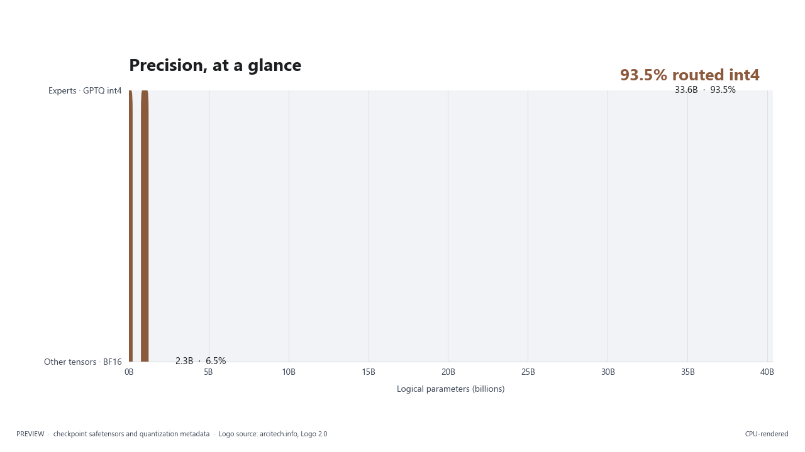
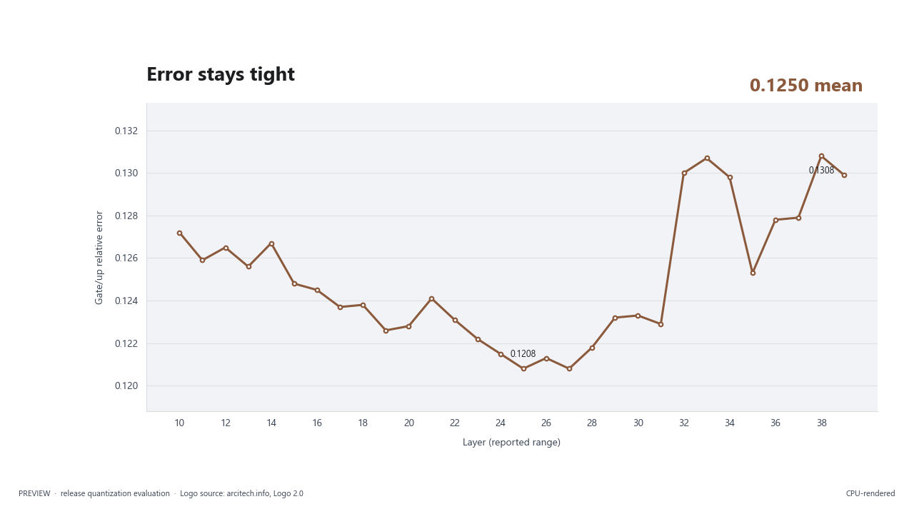
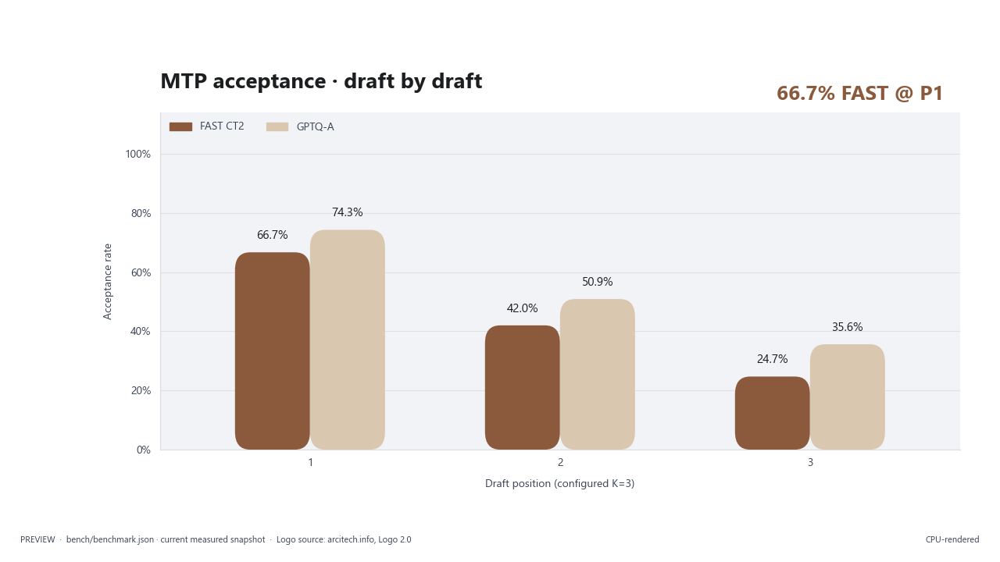

# vLLM XPU Arc

[](LICENSE)
[](https://www.intel.com/content/www/us/en/products/details/discrete-gpus/arc/workstations/a-series.html)
[](https://huggingface.co/arcitech-psp/Tiel-Coder-35B-A3B-W4A16-GPTQ-XPU-MTP)

<picture><source media="(prefers-color-scheme: dark)" srcset="assets/arcitech-logo-white.png"></picture>
<picture><source media="(prefers-color-scheme: dark)" srcset="assets/hero-dark.png"></picture>
<picture><source media="(prefers-color-scheme: dark)" srcset="assets/throughput-dark.png"></picture>
<picture><source media="(prefers-color-scheme: dark)" srcset="assets/precision_map-dark.png"></picture>
<picture><source media="(prefers-color-scheme: dark)" srcset="assets/layer_gptq_relative_error-dark.png"></picture>
<picture><source media="(prefers-color-scheme: dark)" srcset="assets/mtp_acceptance-dark.png"></picture>

This is a reviewable, local build recipe for the best working Intel Arc/XPU
path we have measured with Tiel-Coder: compressed-tensors W4A16 expert weights,
the official BF16 MTP head, and three speculative draft tokens. The default
build is based on vLLM commit `ac7509e2b1db40fec2f03dde1ed4e9dfdc2338c9`
(`0.27.2rc1.dev77+gac7509e2b`), the runtime every number below was measured on,
and includes the core patch, the XPU GGUF plugin source, and optional research
paths. We are only trying to get something useful out there; the numbers below
are campaign measurements, not a certification for every model, driver, or
future vLLM release.

A rebase onto vLLM `v0.30.0` is included under
[`experimental/v0.30-rebase/`](experimental/v0.30-rebase/). It applies cleanly
at source level but **has not been built or served yet**, and stock v0.30.0
crashed on this model in our test window (details below). Use the default
build unless you want to help test the rebase.

## Best working path

The default path is the compressed-tensors Tiel-Coder deployment. It was
measured on one Intel Arc Pro B70 with 32 GB using vLLM
`0.27.2rc1.dev77+gac7509e2b`, PyTorch `2.13.0+xpu`,
`vllm-xpu-kernels 0.1.12.3`, FP8 KV cache, a 131,072-token maximum context,
four sequence slots, 4,096 maximum batched tokens, and three MTP drafts.

| Measurement | Result |
|---|---:|
| Historical FAST CT2 single-request decode | 133–138 tok/s |
| Historical FAST CT2 four-request aggregate decode | 365–378 tok/s |
| Historical FAST CT2 MTP acceptance | 67–81% |
| Night reference FAST CT2 / GPTQ-A, 1 stream | 132.0 / 113.4 tok/s |
| Night reference FAST CT2 / GPTQ-A, 4-stream aggregate | 374.8 / 339.9 tok/s |
| Night reference MTP acceptance | FAST 66.7% / 42.0% / 24.7%; GPTQ-A 74.3% / 50.9% / 35.6% by position |
| Agentic evaluation | 213–215 / 224 |
| Long-context capacity | 4 × 131,072-token slots in the measured pool |

The tested model is [Tiel-Coder 35B-A3B GPTQ W4A16](https://huggingface.co/arcitech-psp/Tiel-Coder-35B-A3B-W4A16-GPTQ-XPU-MTP).
The companion data and reproduction repo is
[https://github.com/arcitech-psp/tiel-coder-xpu](https://github.com/arcitech-psp/tiel-coder-xpu).

## Upstream rebase and status (experimental)

Everything in this section concerns the **experimental** v0.30.0 rebase in
`experimental/v0.30-rebase/`, not the default build. The rebased core patch was
checked against the local v0.30.0 source checkout on 2026-09-25. Upstream feature references are linked to vLLM pull requests; the
local delta is limited to XPU-specific behavior not duplicated by that release.

| Area | Classification | Boundary |
|---|---|---|
| DFlash2 | UPSTREAM | Candidate selector and local convolution: [#52816](https://github.com/vllm-project/vllm/pull/52816), with fused grouped convolution in [#55960](https://github.com/vllm-project/vllm/pull/55960). The old work-in-progress is not duplicated. |
| DSpark | UPSTREAM | The upstream DSpark implementation is [#46995](https://github.com/vllm-project/vllm/pull/46995). The old work-in-progress is not duplicated. |
| Model Runner V2 and offload tiers | UPSTREAM | Weight offloading [#51413](https://github.com/vllm-project/vllm/pull/51413), tiered KV offload [#49644](https://github.com/vllm-project/vllm/pull/49644), and MRV2 default [#53183](https://github.com/vllm-project/vllm/pull/53183). |
| XPU grouped_topk and SYCL activation CustomOps | UPSTREAM | v0.30.0 includes [#53580](https://github.com/vllm-project/vllm/pull/53580) and [#53734](https://github.com/vllm-project/vllm/pull/53734). |
| Qwen3.5 MTP quantization exclusion | UPSTREAM baseline | The v0.30 source carries the exclusion behavior; no local patch is claimed for it. |
| Mixed XPU GDN dispatch | STILL OURS | `0001` splits mixed spec/non-spec batches because the fused XPU call remains exclusive for that combination. |
| XPU GDN snapshot-copy contract | STILL OURS | Opt-in state-layout correction; separate from CUDA rolling-convolution storage. |
| Adaptive MTP and exact C1 graph capture | STILL OURS | Opt-in research gates in `adaptive/` and `0001`; disabled by Docker defaults. |
| oneDNN MXFP4 W4A16 and draft INT4 | STILL OURS | Separate from v0.30 native XPU MXFP4 and MTP paths; optional only. |
| GGUF XPU plugin and SYCL k-quant MoE | STILL OURS | Out-of-tree plugin delta; it was rebased from the old private baseline onto plugin main `e2b8ad532b8b`. |

Patch artifact classification:

| Patch | Classification | Evidence |
|---|---|---|
| `patches/0001-vllm-ac7509e2b-xpu-extras.patch` | DEFAULT | The core delta the measured runtime was built from, against `ac7509e2b`. |
| `patches/0002-vllm-gguf-plugin-56bfc18.patch` | DEFAULT | The GGUF plugin delta against plugin `56bfc18`. |
| `experimental/v0.30-rebase/patches/0001-vllm-v0.30.0-ced6857-xpu-extras.patch` | EXPERIMENTAL | 9 files; clean `git apply --check` on v0.30.0. Not built or served. |
| `experimental/v0.30-rebase/patches/0002-vllm-gguf-plugin-e2b8ad5.patch` | EXPERIMENTAL | 14 files; clean apply to plugin main `e2b8ad532b8b5ea175100202c30430c1d2b5e6a8`. Not built or served. |

| STATUS | Result |
|---|---|
| Core patch | Rebasing complete; applies cleanly to v0.30.0. Not yet built or served. |
| GGUF patch | Rebasing complete; applies cleanly to plugin main `e2b8ad5`. Not yet built or served. |
| Stock v0.30.0 serving | GPTQ-A loaded and reached compile/warmup, then segfaulted in stock SYCL top-k; a no-graph retry failed XPU memory reservation before `/v1/models`. |
| Performance | Exact reference method completed on FAST and custom GPTQ-A; stock performance was not measured. |
| Sharp template | Updated to latest fetched v22.5.0 content; diff is limited to removal of the model-specific terse lead. |

## Feature matrix

Status labels describe the measured boundary. `working` means the path
was exercised in the campaign; `partial` and `experimental` are included for
review and future work, not as the default launch route.

| Feature | Status | Tested boundary |
|---|---|---|
| Compressed-tensors W4A16 fused int4 MoE | working | Tiel-Coder body, group 128, native XPU fused-MoE path. |
| MTP speculative decoding | working | Official BF16 MTP head, three drafts, 67–81% measured acceptance. |
| FP8 KV cache | working | Used in the measured Tiel-Coder and long-context runs. |
| Tool calling | working | `qwen3_coder`, including streamed calls. |
| Reasoning parser | working | `qwen3` reasoning/content split on the tested path. |
| Vision input | working | Exercised with a 4 MP processing limit. |
| 4 × 128K concurrency | working | Four 131,072-token slots fit the measured KV pool. |
| MXFP4 W4A16 | partial | oneDNN/SYCL source and build gate included; not the default path. |
| XPU graphs | partial | Exact-length C1 dispatch is gated and hardware-sensitive. |
| GGUF k-quant MoE | experimental | Q3_K/Q4_K/Q5_K/Q6_K SYCL source is included in the plugin. |
| Adaptive MTP | experimental | Opt-in controller for 2–8 drafts; no verifier or sampling change. |
| Gated DeltaNet snapshot copy | experimental | Opt-in XPU state-copy contract. |
| DFlash2 / DSpark | UPSTREAM | Use v0.30.0's upstream implementations; the local adaptive MTP path is not a substitute. |
| Weight and KV offload tiers | UPSTREAM | Present in v0.30.0; not implemented by this repository's patch. |

The stock v0.30.0 DFlash2/DSpark, grouped-top-k, SYCL activation, and graph
features are upstream capabilities. Their presence does not prove that the
local W4A16/MTP performance path is unchanged; that requires a side-by-side
benchmark.

Failed experiments: notes coming later.

## Install and build

The repository contains source and build recipes, not model weights or runtime
caches. The core patch is the authoritative review artifact.

```bash
git clone https://github.com/vllm-project/vllm.git
git -C vllm checkout ac7509e2b1db40fec2f03dde1ed4e9dfdc2338c9
./scripts/apply-vllm-core-patch.sh ./vllm
docker build -t vllm-xpu-arc:local .
```

The Dockerfile rebuilds the measured runtime from the public vLLM XPU base
image digest for that commit plus the patches here. It is a reconstruction:
the measured image was built in place, and this Dockerfile has not yet been
rebuilt from scratch on a clean machine. Please report whether it builds for
you.

To try the experimental v0.30.0 rebase instead:

```bash
git -C vllm checkout ced6857afa0ea7b2e3f0846a62e1394e90f15607
./experimental/v0.30-rebase/scripts/apply-vllm-core-patch.sh ./vllm
docker build -f experimental/v0.30-rebase/Dockerfile -t vllm-xpu-arc:v030-test .
```

The Dockerfile applies the pinned core patch, installs the included GGUF
plugin without its CUDA extension, compiles the SYCL GGUF kernel, and builds
the optional adaptive GDN and MXFP4 extensions. The optional native build
helpers assert that `torch.xpu` has not been initialized during compilation:

```bash
python adaptive/build_kernel.py
python mxfp4/build_mxfp4_w4a16.py --onednn installed
```

The MXFP4 recipe expects an external oneDNN source/install with Intel GPU
SYCL support. It is not required for the best working Tiel-Coder path.

## Run the best working path

Mount the model read-only and use the supplied launcher:

```bash
MODEL_DIR=/models/Tiel-Coder-35B-A3B-W4A16-GPTQ-XPU-MTP \
IMAGE=vllm-xpu-arc:local \
./scripts/serve-example.sh
```

The launcher keeps model weights outside this repository. Use the model's
Tiel Sharp template, BF16 compute, FP8 KV, four 131K slots, three MTP drafts,
and the parser settings shown in the model repository. Re-measure memory
capacity for a different model, driver, or slot count.

## What is included

- `patches/0001-vllm-ac7509e2b-xpu-extras.patch` — the vLLM core delta for
  XPU dispatch, MTP hooks, replay pinning, exact C1 graphs, and optional draft
  paths, against the measured `ac7509e2b` base.
- `patches/0002-vllm-gguf-plugin-56bfc18.patch` — the included GGUF plugin
  delta and XPU k-quant MoE path.
- `experimental/v0.30-rebase/` — the same deltas rebased onto vLLM v0.30.0 and
  plugin main `e2b8ad5`, with their own Dockerfile and apply script. Source-level
  checks only; not built or served yet.
- `plugins/vllm-gguf-plugin/` — plugin source and tests.
- `adaptive/` — optional adaptive MTP and Gated DeltaNet SYCL sources.
- `mxfp4/` — optional oneDNN-backed MXFP4 W4A16 sources.
- `scripts/` — patch and container-run helpers.

## Limits

The working measurements were made on one Intel Arc Pro B70. Other Intel GPUs,
CUDA, stock-vLLM equivalence, and future driver combinations are untested.
Four 180K contexts exceeded the measured pool; keep the documented four-slot,
131,072-token boundary until a new capacity measurement exists. The Docker
build was not executed on this preparation machine; source, patch, compile,
and privacy checks were performed.

## Credits

This work stands on the vLLM project and its Intel XPU contributors, Intel's
Arc hardware and XPU software stack, the Ornith team, `peculiar-ragdoll` for
Tiel and the Sharp template, biMEMO's earlier reference work, and the Hugging
Face community. The related model is published at the
[Hugging Face account `arcitech-psp`](https://huggingface.co/arcitech-psp).

Credit: GPT 5.6 Luna (Codex), directed by Claude.

### Sharp template provenance

Latest fetched source: `peculiar-ragdoll/Qwen-Sharp-Chat-Templates`, revision
`85461fc118aaf25e7319c7ecf2481f944aac3a32`, modified 2026-09-10. The local
fixture differs only in the two terse-lead strings: the latest revision removes
the model-identifying phrase. The fixture was not changed during this rebase.

## Feedback and contact

Feedback form: [https://docs.google.com/forms/d/1gaUBeulGlZwo8gt4eucGpg3biCKy-tli79urdTesXSI/viewform](https://docs.google.com/forms/d/1gaUBeulGlZwo8gt4eucGpg3biCKy-tli79urdTesXSI/viewform). Direct contact:
[parthpatel266@gmail.com](mailto:parthpatel266@gmail.com). GitHub account:
[arcitech-psp](https://github.com/arcitech-psp).

## License and attribution

Upstream vLLM and plugin files retain their Apache-2.0 notices. New code in
this repository follows Apache-2.0 as documented in `LICENSE` and `NOTICE`.
Please review the upstream attribution before publishing a derivative build.
