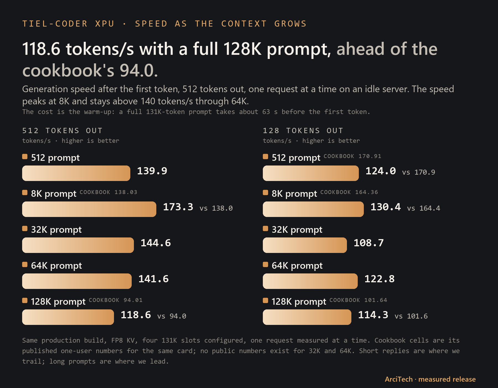

# vLLM XPU Arc

[](LICENSE)
[](https://www.intel.com/content/www/us/en/products/details/discrete-gpus/arc/workstations/a-series.html)
[](https://huggingface.co/arcitech-psp/Tiel-Coder-35B-A3B-W4A16-GPTQ-XPU-MTP)

<picture><source media="(prefers-color-scheme: dark)" srcset="assets/at-logo-white.png"></picture>


This is a reviewable local build recipe for the best working Intel Arc/XPU
route measured with Tiel-Coder: compressed-tensors W4A16 expert weights, the
official BF16 MTP head, and three speculative draft tokens. It is a measured
route, not a certification for every model, driver, or future vLLM release.

**Model source:** [peculiar-ragdoll's Tiel-Coder-35B-A3B](https://huggingface.co/peculiar-ragdoll/Tiel-Coder-35B-A3B-GGUF-MTP), which is [Ornith-1.5-35B-A3B](https://huggingface.co/ornith-ai/Ornith-1.5-35B-A3B) with the [Sharp chat template](https://huggingface.co/peculiar-ragdoll/Qwen-Sharp-Chat-Templates).

## At a glance

- **One Intel Arc Pro B70, 32 GB** served the tested 35B-parameter coding model.
- **144.4 tokens/s for one stream; 380.4 tokens/s across four** on the fixed-K3 route.
- **217.7 of 224** as the mean of ten quality runs; the same-night baseline mean was 217.2.
- **526,012 KV tokens (4.01× 131,072)** in the measured configuration.
- **vLLM 0.27.2rc1.dev77+gac7509e2b**, a custom XPU build with PyTorch XPU support.

Tokens per second (tokens/s) is how quickly generated text arrives. A shared
total is the combined output of several concurrent users.

## Test system

One ordinary AM4 desktop with one 32 GB workstation GPU — no datacenter hardware.
Everything below was read from the machine itself.

### Compute

| Part | Details |
|---|---|
| GPU — runs the model | **Intel Arc Pro B70**, 32 GB (30.3 GiB usable), 256 compute units, up to 2.8 GHz, on **PCIe 4.0 x16** (the card supports PCIe 5.0; the B550 board tops out at 4.0) |
| Second GPU — idle in these tests | Intel Arc A310 LP, 4 GB, on PCIe 3.0 x4 (chipset slot) |
| CPU | **AMD Ryzen 7 5800X**, 8 cores / 16 threads, 32 MB L3 + 4 MB L2 cache, up to 5.49 GHz as reported by the OS |

### Memory and storage

| Part | Details |
|---|---|
| System memory | **32 GB DDR4-3200**, 4 × 8 GB, dual channel |
| Motherboard | ASUS ROG Strix B550-F Gaming (AM4), PCIe 4.0 lanes from the CPU |
| Model storage — weights load from here | **Samsung PM9A1 1 TB NVMe**, PCIe 4.0 x4 |
| Other drive — archive only | WD Green 1.5 TB HDD; the model is not loaded from it |

### Usage while serving

| What | Amount |
|---|---|
| Model weights | **22.0 GB** (20.5 GiB) in 42 files, including the 1.7 GB draft (MTP) head |
| GPU memory reserved by vLLM | 97% of 30.3 GiB, about **29.4 GiB** (weights + KV cache + runtime) |
| KV cache | **526,012 tokens** in FP8 — room for 4.01 full 131,072-token conversations |
| Host memory in use | about 7.5 GB of 32 GB (spot reading with the vLLM server running) |

### Software

| Part | Details |
|---|---|
| OS | Ubuntu 24.04.4 LTS, Linux kernel 7.0 |
| Intel GPU driver | compute-runtime 26.22.38646.4 (Level Zero + OpenCL), Level Zero loader 1.28.6, IGC 2.11.12 |
| Serving stack | Docker 29.1.3, vLLM 0.27.2rc1.dev77+gac7509e2b ([custom XPU build](https://github.com/arcitech-psp/vllm-xpu-arc)), PyTorch 2.13.0+xpu, vllm-xpu-kernels 0.1.12.3 |
| Serving settings | FP8 KV cache, 131,072-token context, 4 concurrent sequences, 4,096 max batched tokens, 3 MTP draft tokens |

## Measured results


The original published single-run result of **219/224** remains useful historical context. The controlled
10-run comparison below uses the same runner and same-night baseline: the baseline mean was 217.2,
with runs from 214 to 219, so the old 219 is within that run-to-run range.

| Build | 10-run mean | Run range | Code mean | Tool mean | Edit mean |
|---|---:|---:|---:|---:|---:|
| **Tiel-Coder XPU fixed-K3 + draft INT4** | **217.7** | **215–221** | **180.3** | **17.7** | **19.7** |
| Same-night published-build baseline | 217.2 | 214–219 | 180.2 | 17.1 | 19.9 |

The fixed route's minimum was 215/224. It passed cold/warm identity and a 20-minute,
four-chat soak with zero preemptions.


### Compared with our first release

| | First release (Sept 26) | This update | Change |
|---|---:|---:|---:|
| One user, decode | 116.9 tok/s | **148 tok/s** (median; best run 152) | **+27%** |
| Four users, total | 339.9 tok/s | **380.4 tok/s** | **+12%** |
| Four users, each | 92.5–94.0 tok/s | **102 tok/s** (median of 24; best 108) | **+9%** |
| Peak cell (8K prompt, 512 out) | — | **174.3 tok/s** | — |
| Quality (internal eval, /224) | 219 (single run) | **217.7 average of 10, best 221** | best run +2 |

Same card, same weights, same four 131K slots. For a strictly fair read: re-measured the same
night with this update's harness, the first-release build gives 132.7 tok/s (one user) and
373.1 (four users), so part of the jump is the more careful measurement and part is the new
serving route. Both comparisons are below.

### Speed as the context grows


| Prompt | 512 out | 128 out | Cookbook (512 / 128 out) |
|---|---:|---:|---:|
| 512 | 139.9 | 124.0 | 148.35 / 170.91 |
| 8K | **173.3** | 130.4 | 138.03 / 164.36 |
| 32K | 144.6 | 108.7 | — |
| 64K | 141.6 | 122.8 | — |
| Full 128K | **118.6** | **114.3** | 94.01 / 101.64 |

Tokens/s after the first token, median of three isolated requests on an idle server, same production build. A full 131K-token prompt takes about 63 s before the first token; after the 128K runs the server still reported 4.01x concurrency at 131K and 0 preemptions. Short replies are where this build trails the cookbook; long prompts are where it leads.

The speed comparison is the median of three blocks from the same `tfinal_bench.sh` measurement,
run back-to-back with the baseline. `tfast_bench.py` uses deterministic temperature-zero cells.

| Cell | Same-night re-run of the first-release build | This update | Change | Cookbook reference |
|---|---:|---:|---:|---:|
| bench, 1 stream | 132.7 | **144.4** | **+8.8%** | — |
| bench, 4 streams | 373.1 | **380.4** | **+2.0%** | — |
| 512 × 32 | 103.7 | **114.6** | **+10.5%** | 178.34 |
| 512 × 128 | 112.5 | **123.1** | **+9.4%** | 170.91 |
| 512 × 512 | 119.6 | **133.7** | **+11.8%** | 148.35 |
| 8192 × 32 | 107.6 | **109.4** | **+1.7%** | 156.28 |
| 8192 × 128 | 143.7 | **156.0** | **+8.6%** | 164.36 |
| 8192 × 512 | 166.9 | **174.3** | **+4.4%** | 138.03 |

All six cells beat the same-wrapper baseline. The long 8192 × 512 cell is ahead of the
[public B70 cookbook](https://github.com/SergiioB/intel-arc-pro-b70-inference-cookbook)'s
138.03 reference, while the short cells still trail its 178.34, 170.91, and 148.35 numbers.
That is not a like-for-like setup: the cookbook reference is one user with 16-bit KV and a
larger batch, while this route keeps four 131K conversations with FP8 KV.


The BF16-head acceptance screen measured 88.2%, 72.4%, 54.8%, and 41.8% at positions 0–3.
The fixed-K3 serving recipe uses the first three positions; the fourth value is retained from
the K4 acceptance screen for completeness.

## How to read this

- **Token:** a small piece of text; words may be one or several tokens.
- **Tokens/s:** generated tokens per second, a practical speed measure.
- **MoE:** mixture of experts; only selected experts handle each token.
- **int4 / BF16:** compact 4-bit routed-expert weights and retained 16-bit tensors.
- **MTP:** multi-token prediction; a draft path proposes tokens for verification.
- **KV cache:** saved attention state that avoids recomputing the conversation so far.
- **Context:** the maximum conversation length the model can consider at once.

## Best working path

The default route uses the compressed-tensors Tiel-Coder deployment and was
measured with vLLM `0.27.2rc1.dev77+gac7509e2b`, PyTorch `2.13.0+xpu`,
`vllm-xpu-kernels 0.1.12.3`, FP8 KV cache, a 131,072-token maximum context,
four sequence slots, 4,096 maximum batched tokens, and three MTP drafts.

The repository contains source and build recipes, not model weights or runtime
caches. Build the pinned core patch and image, then mount the model read-only
using the launcher supplied with the release. Set the launcher's model input to
the model you downloaded from the
[Hugging Face model page](https://huggingface.co/arcitech-psp/Tiel-Coder-35B-A3B-W4A16-GPTQ-XPU-MTP).

```bash
git clone https://github.com/vllm-project/vllm.git
git -C vllm checkout ac7509e2b1db40fec2f03dde1ed4e9dfdc2338c9
./scripts/apply-vllm-core-patch.sh vllm
docker build -t vllm-xpu-arc:local .
```

For the fixed fast route, use [`scripts/serve-fast.sh`](scripts/serve-fast.sh). Set
`MODEL_DIR` to the model directory and provide any required runtime overlay paths through
its variables; the script keeps `B70_MTP_BF16_DRAFT=1`, `B70_DRAFT_LMHEAD_INT4=1`,
`B70_DRAFT_MTP_INT4=1`, fixed K3, FP8 KV, four slots, and the startup prewarm together.
The helper sources are [`patches/vllm_xpu_draft_lmhead_int4.py`](patches/vllm_xpu_draft_lmhead_int4.py),
[`patches/vllm_xpu_draft_mtp_int4.py`](patches/vllm_xpu_draft_mtp_int4.py),
[`scripts/tiel-mtp4-entrypoint.sh`](scripts/tiel-mtp4-entrypoint.sh),
[`scripts/prewarm_shortreply.py`](scripts/prewarm_shortreply.py), and
[`bench/tfinal_bench.sh`](bench/tfinal_bench.sh).

Use the model's Tiel [Sharp template](https://huggingface.co/peculiar-ragdoll/Qwen-Sharp-Chat-Templates), BF16 compute, FP8 KV cache, four 131K
slots, three MTP drafts, and the parser settings shown in the model card.
Re-measure capacity for a different model, driver, or slot count.

## Decision models on Arc: Mintelica

`decision/` serves [sky7350's Mica-v0.1-4B](https://huggingface.co/sky7350/Mica-v0.1-4B), a small decision model
built on [Qwen3.5-4B](https://huggingface.co/Qwen/Qwen3.5-4B), on Intel Arc. Mica ships for CUDA; we call the Intel
builds **Mintelica** (Mica for Intel).
Mica reads a state and a question once and returns a probability for each allowed answer (yes/no, a choice, or a
score). It generates no text, so one decision costs one prefill.

`s1_systemone.py` puts the TypeSafe `/v1/systemone` API in front of vLLM XPU. Request parsing, the prompt and the
answer shapes are Mica's own code, so JevBench's `typesafe` adapter works unchanged. Each request is one prefill with
`max_tokens 1`. vLLM returns the raw logits of the option label tokens only (`allowed_token_ids` with
`--logprobs-mode processed_logits`). The front end divides them by sky7350's fitted temperature (1.1245) and applies
a softmax.

| Build (Hugging Face) | Weights loaded | JevBench easy / original / hard, B580 | same, B70 | p50 original, B580 / B70 |
|---|---:|---|---|---:|
| [Mintelica-v0.1-4B-BF16](https://huggingface.co/arcitech-psp/Mintelica-v0.1-4B-BF16) (sky7350's weights) | 7.87 GiB | 100 / 100 / 63.7 | 100 / 100 / 63.4 | 78 / 72 ms |
| [Mintelica-v0.1-4B-FP8](https://huggingface.co/arcitech-psp/Mintelica-v0.1-4B-FP8), BF16 math (W8A16) **recommended** | 4.55 GiB | 100 / 100 / 67.9 | 100 / 100 / 65.5 | 68 / 66 ms |
| same FP8 files, FP8 math (W8A8) | 4.55 GiB | 100 / 100 / 64.0 | 100 / 100 / 63.1 | 88 / 78 ms |
| [Mintelica-v0.1-4B-INT8](https://huggingface.co/arcitech-psp/Mintelica-v0.1-4B-INT8), our XPU INT8 kernel | 4.55 GiB | 100 / 100 / 65.2 | 100 / 100 / 62.5 * | 84 ms / not measured |
| CUDA reference: Mica's own server, RTX 4080 Laptop | BF16 GGUF | 100 / 100 / 64.0 | | 75 ms |

Each Arc build was run three times per card (mean shown), with one request at a time from a separate machine.
The model cards list the full test systems, the min–max ranges and the p50 per tier.
The hard tier has 111 items, so one item is 0.9 points. We read the FP8 build's 65.5–67.9 as "no loss", not as a gain.
FP8 math (W8A8) was not faster than FP8 weights with BF16 math on either Battlemage card.

INT8 runs on our fused XPU INT8 kernel ([`decision/int8-kernel`](decision/int8-kernel)), which `serve-decision.sh`
mounts automatically for INT8 checkpoints. vLLM's generic Triton INT8 was ~3.5–6× slower; we added a kernel. On the
B580, one request takes 52 / 181 / 600 ms at short / ~1K / ~4K tokens, against FP8's 50 / 188 / 679 ms (median of 20).
\* INT8 on the B70 was run only on the Triton path. The kernel's outputs are bit-identical to it, so the accuracy
carries over; the B70 latency was not re-measured.

Stability, with the same ~4K-token request sent 20 times on the B580: BF16 and FP8 gave the same answer 20/20 times.
INT8 gave it 18/20 times, because that request sits near a tie between two options.

### Serving

```bash
git clone https://github.com/akivet/Mica-v0.1-4B          # Mica's prompt, codebook and wire format
docker build -t vllm-xpu-arc:local .                        # this repository's image (see "Best working path")
MODEL_DIR=/path/to/Mintelica-v0.1-4B-FP8 MICA_SRC=$PWD/Mica-v0.1-4B ./decision/serve-b580.sh   # or serve-b70.sh
curl -s localhost:8012/v1/systemone -H 'Content-Type: application/json' -d '{
  "state": "The user asked to delete the staging database. No approval has been given.",
  "questions": {"q": {"type": "noul", "instructions": "Should the agent delete it now?"}}}'
```

`serve-decision.sh` holds the settings we tested. The presets only change the card index, the memory share and the
number of sequences. BF16 on the 12 GB B580 needs a larger `UTIL` than the preset's 0.55, since its weights alone
are 7.87 GiB. Set `W8A8=1` to serve the FP8 files with FP8 math (`--linear-backend xpu`).

### Fixes these scripts carry

- **`SYCL_CACHE_PERSISTENT=0`.** With the image default (`1`), the persistent SYCL device-code cache segfaulted on
  the first request. Turning it off costs some warm-up on each start and avoids the crash.
- **Device flags.** `--device /dev/dri --privileged --group-add <render group>` pass the Arc card in, and
  `ZE_AFFINITY_MASK=<index>` pins the model to one card. The script reads the render group's GID from
  `/dev/dri/renderD*` and falls back to `render`. The tested runs used `--privileged`; we have not validated a
  non-privileged run for this model. On the B70 we also set `ZE_FLAT_DEVICE_HIERARCHY=COMPOSITE`.
- **`adaptive_mtp` on the path.** The patched scheduler imports `adaptive_mtp` at startup, even when adaptive MTP
  is off. The image puts `/opt/vllm-xpu-arc/adaptive` on `PYTHONPATH`, but passing your own `-e PYTHONPATH=...`
  replaces that entry and vLLM fails to start. The script mounts `adaptive/adaptive_mtp.py` and keeps both paths.
- **Eager mode.** `--enforce-eager`, with XPU graphs off. For these one-prefill requests, XPU graphs gave no prefill gain.

### Building and measuring

- `quantize_fp8.py` and `quantize_int8.py` run at the tensor level, with no model load and no calibration data.
  They use per-output-channel symmetric scales and write compressed-tensors output. The Mintelica builds use
  `SCOPE=all`: MLP, full attention and Gated DeltaNet projections. Embeddings, norms, conv1d and the small gate
  projections stay BF16.
- `bench/run_jev.sh` runs [JevBench](https://github.com/fstandhartinger/jevbench) public easy, original and hard
  through the unchanged `typesafe` adapter. `bench/repeat_jev.sh` repeats it N times and writes the mean, min
  and max. `bench/load_test.py` replays the recorded JevBench requests with 1, 4, 8 and 16 concurrent clients.
- Copy `calibration.json` (sky7350's temperature) into any model folder you build yourself.

## For practitioners

### Feature matrix

Status labels describe the measured boundary. `working` means the path was
exercised in the campaign; `partial` and `experimental` are included for
review and future work, not as the default launch route.

| Feature | Status | Tested boundary |
|---|---|---|
| Compressed-tensors W4A16 fused int4 MoE | working | Tiel-Coder body, group 128, native XPU fused-MoE path. |
| MTP speculative decoding | working | Official BF16 MTP head, three drafts, measured acceptance reported above. |
| FP8 KV cache | working | Used in the measured Tiel-Coder and long-context runs. |
| Tool calling | working | `qwen3_coder`, including streamed calls. |
| Reasoning parser | working | `qwen3` reasoning/content split on the tested path. |
| Vision input | working | Exercised with a 4 MP processing limit. |
| 4 × 128K concurrency | working | Four 131,072-token slots fit the measured KV pool. |
| MXFP4 W4A16 | partial | oneDNN/SYCL source and build gate included; not the default path. |
| XPU graphs | partial | Exact-length C1 dispatch is gated and hardware-sensitive. |
| GGUF k-quant MoE | experimental | Q3_K/Q4_K/Q5_K/Q6_K SYCL source is included in the plugin. |
| Adaptive MTP | experimental | Opt-in controller for 2–8 drafts; no verifier or sampling change. |
| Gated DeltaNet snapshot copy | experimental | Opt-in XPU state-copy contract. |
| DFlash2 / DSpark | UPSTREAM | Use v0.30.0's upstream implementations; the local adaptive MTP path is not a substitute. |
| Weight and KV offload tiers | UPSTREAM | Present in v0.30.0; not implemented by this repository's patch. |

### Experimental v0.30.0 rebase

The rebase under `experimental/v0.30-rebase/` applies cleanly at source level,
but **has not been built or served**. Stock v0.30.0 loaded GPTQ-A and reached
compile/warmup, then segfaulted in stock SYCL top-k; a no-graph retry failed the
XPU memory reservation before a model endpoint became available. Stock
performance was not measured. Use the default build for the measured route.

The rebase keeps upstream v0.30 features separate from local XPU deltas:
mixed XPU GDN dispatch, the XPU GDN snapshot-copy contract, adaptive MTP and
exact C1 graph gates, optional oneDNN MXFP4 W4A16 and draft int4, and the GGUF
XPU plugin/SYCL k-quant MoE path. Those optional paths are not the release
benchmark.

### Included source

- `patches/0001-vllm-ac7509e2b-xpu-extras.patch` — measured XPU core delta.
- `patches/0002-vllm-gguf-plugin-56bfc18.patch` — included GGUF plugin delta.
- `experimental/v0.30-rebase/` — source-level rebase, not built or served.
- `plugins/vllm-gguf-plugin/` — plugin source and tests.
- `adaptive/` — optional adaptive MTP and Gated DeltaNet SYCL sources.
- `mxfp4/` — optional oneDNN-backed MXFP4 W4A16 sources.
- `scripts/` — patch, fixed-K3 serving, prewarm, and container-run helpers.
- `bench/tfinal_bench.sh` and `bench/tfast_bench.py` — the repeatable median-of-three speed measurement.
- `decision/` — Mintelica: the TypeSafe `/v1/systemone` front end, serve scripts, FP8/INT8 quantizers and JevBench/load scripts.

## Limits and privacy

- Working measurements were made on one Intel Arc Pro B70.
- Other Intel GPUs, CUDA, stock-vLLM equivalence, and future driver combinations are untested.
- The measured boundary is four 131,072-token slots; larger contexts require a new capacity measurement.
- The Docker build was not executed on this preparation machine; source, patch, compile, and privacy checks were performed.
- No calibration data or private prompts are included.

## Credits

This work stands on:

- [`peculiar-ragdoll`](https://huggingface.co/peculiar-ragdoll) — [Tiel-Coder-35B-A3B](https://huggingface.co/peculiar-ragdoll/Tiel-Coder-35B-A3B-GGUF-MTP)
  (the source this release is named after; also published as [GGUF](https://huggingface.co/peculiar-ragdoll/Tiel-Coder-35B-A3B-GGUF))
  and the [Sharp chat template](https://huggingface.co/peculiar-ragdoll/Qwen-Sharp-Chat-Templates) shipped with the model as `chat_template.jinja`.
- [Ornith team (`ornith-ai`)](https://huggingface.co/ornith-ai) — [Ornith-1.5-35B-A3B](https://huggingface.co/ornith-ai/Ornith-1.5-35B-A3B),
  the upstream model of Tiel-Coder, its official BF16 weights and MTP head, and MIT licensing.
- [biMEMO](https://huggingface.co/biMEMO) — [Ornith-1.5-35B-A3B-int4-AutoRound-MTP](https://huggingface.co/biMEMO/Ornith-1.5-35B-A3B-int4-AutoRound-MTP),
  earlier int4/MTP reference work and the AutoRound int4 + MTP build compared on the model card.
- [Community Tiel GGUF](https://huggingface.co/peculiar-ragdoll/Tiel-Coder-35B-A3B-GGUF) by `peculiar-ragdoll` — the GGUF build compared on the model card.
- [Intel Arc Pro B70 inference cookbook](https://github.com/SergiioB/intel-arc-pro-b70-inference-cookbook) by SergiioB — the public speed reference.
- [sky7350](https://huggingface.co/sky7350) — [Mica-v0.1-4B](https://huggingface.co/sky7350/Mica-v0.1-4B) (code: [akivet/Mica-v0.1-4B](https://github.com/akivet/Mica-v0.1-4B)): the decision model, its prompt, label codebook and calibration, served by `decision/`.
- [Qwen team](https://huggingface.co/Qwen) — [Qwen3.5-4B](https://huggingface.co/Qwen/Qwen3.5-4B), the base model under Mica.
- [JevBench](https://github.com/fstandhartinger/jevbench) by fstandhartinger — the decision benchmark and its `typesafe` adapter.
- [TypeSafe AI](https://typesafe.ai/blog/introducing-system-one-models-and-jev) — Jev and the `/v1/systemone` format.
- [vLLM project](https://github.com/vllm-project/vllm) and Intel XPU contributors ([vllm-xpu-kernels](https://github.com/vllm-project/vllm-xpu-kernels)) — serving foundation and XPU work.
- Intel — Arc hardware and XPU software stack ([compute-runtime](https://github.com/intel/compute-runtime)).
- [Hugging Face](https://huggingface.co) community — models, tools, and practical feedback.

The related model is published at the
[Hugging Face account `arcitech-psp`](https://huggingface.co/arcitech-psp).

## Feedback

Please use the public [GitHub account](https://github.com/arcitech-psp) for feedback.

## License and related pages

Upstream vLLM and plugin files retain their Apache-2.0 notices. New code in
this repository follows Apache-2.0 as documented in `LICENSE` and `NOTICE`.

- [Tiel-Coder data repository](https://github.com/arcitech-psp/tiel-coder-xpu)
- [Tiel-Coder model card](https://huggingface.co/arcitech-psp/Tiel-Coder-35B-A3B-W4A16-GPTQ-XPU-MTP)

## Holo4-27B on the v0.30 XPU branch

`holo4-v030` builds our fork on the pinned official vLLM v0.30.0 XPU image.
It uses Intel's official oneAPI development image for CPU compilation; no
third-party serving image or kernel overlay is a build input. Runtime
qualification is recorded separately in `/home/psp/fork-update/GATES.md`.
The existing Tiel measurements above do not describe Holo4 or this v0.30 build.

```bash
MAX_JOBS=2 docker build --build-arg MAX_JOBS=2 \
  -f experimental/v0.30-rebase/Dockerfile \
  -t vllm-xpu-arc:v030-20261006 .

# On HADES, only after Claude creates /home/psp/holo4/B70-FREE:
MODEL_DIR=/home/psp/holo4/chunks/c0 scripts/serve-holo4.sh
```

The native `auto-round` loader in v0.30 selects INC for
`auto_round:auto_gptq` symmetric INT4 group-128 weights. The launcher defaults to
`VLLM_XPU_INC_WNA16_BACKEND=w4a16`, explicitly selecting oneDNN W4A16
for the B70. `auto` remains an optional backend override; it is not the
launcher's default.
`onednn` is not a valid v0.30 environment value. The visual tower, selected GDN projections and target
LM head retain the publisher/exporter's BF16 weights. The added boundary
patch uses the pinned XPU kernel's native BF16 oneDNN path for target linears.
`VLLM_XPU_INT4_COMPUTE_DTYPE=float16` selects an explicit private FP16 fallback
with one-time scale conversion and BF16 output. Runtime gates must qualify the
selected path; no quantization export is rewritten.

The grafted BF16 Qwen MTP head builds unquantized before our draft-only
INT4 helpers activate. The helpers preserve target weights and restore
the model dtype at each draft boundary. The helper aliases now match the
rebased call sites, and zero-valued groups have finite positive scales.
The existing mixed-GDN split and the cookbook partial-final-group fix are
included. K=3 is the initial speculative configuration; acceptance and
performance must be measured on Holo4.

The serve script enables vision, FP8 attention KV, prefix caching, a
131072-token limit, Qwen tool/reasoning parsers, and LoRA rank 32. Requests
select the registered adapter with `"model": "jev-decision"`. The default
Mamba SSM cache dtype is FP16, matching our earlier dense Qwen route; set
`MAMBA_SSM_CACHE_DTYPE=float32` for a separately measured comparison.
`MAX_NUM_SEQS` starts at eight. It is a scheduler limit, not a claim that
eight full 128K sequences fit. The measured KV pool and full-length
capacity belong in the gate evidence before tuning that limit.

Our wrapper prepends `enable_thinking=false` and `reasoning_effort=low`
defaults to Holo4's own native tokenizer template, preserving its vision
and tool syntax. A request can override these template variables.
The script writes only under the fork-update runtime directory; model
and adapter mounts are read-only. No model is downloaded.

The retained stock crash log shows a PyTorch BF16 top-k failure inside
SYCL persistent-device-cache lookup. This build disables that disk cache
and adds a guarded, exact sort fallback for XPU BF16 logprob top-k; the
normal FP32/other-device paths remain upstream. Graph execution stays on.
The stock retry failed before model loading with 6.59/30.3 GiB free versus
a 29.39 GiB reservation. The original reservation check remains intact.
Startup records total/free/allocated/reserved memory, and a separate
preflight rejects the wrong GPU or competing allocations. The old log
does not identify which client held the unavailable memory.

Credits: [Hcompany Holo4](https://huggingface.co/Hcompany), the
[Qwen team](https://github.com/QwenLM), [AutoRound / Intel](https://github.com/intel/auto-round),
and [vLLM](https://github.com/vllm-project/vllm). Our fork changes remain
Apache-2.0; publisher/model and adapter terms remain their own.
